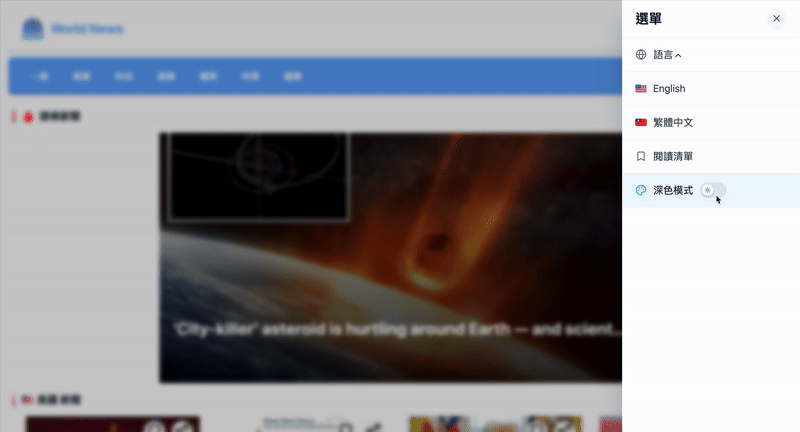

## News Website

一個使用 React 和 Vite 建立的新聞網站專案，提供直覺的操作界面與全面的閱讀體驗。

#### 主要功能

- 熱門新聞
  
- 搜尋功能
  
- 收藏新聞
  
- 新聞瀏覽
  
- 新聞分類
  
- 多國語系
  
- 深色模式
  
- RWD 響應式網站

#### 使用技術

- React
- Vite
- Tailwind
- React Router
- Axios
- React i18n

#### 安裝與執行

##### 1️⃣ 安裝依賴

```
npm install
```

##### 2️⃣ 啟動開發伺服器

```
npm run dev
```
